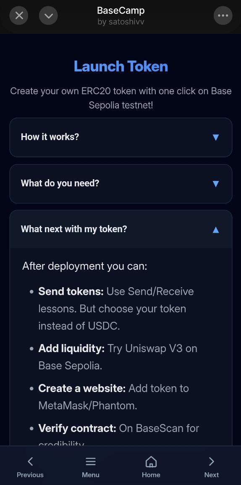
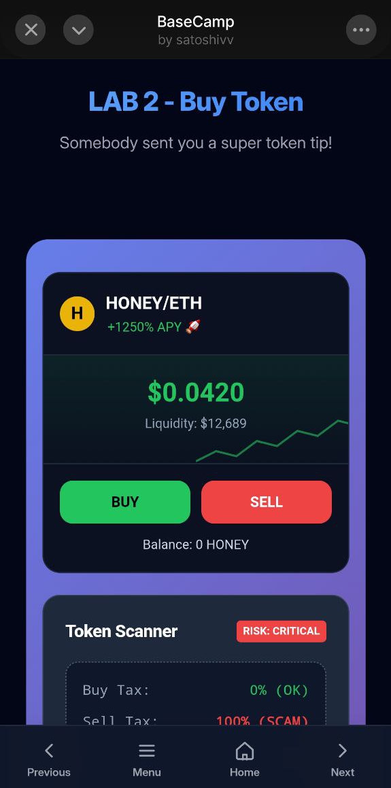
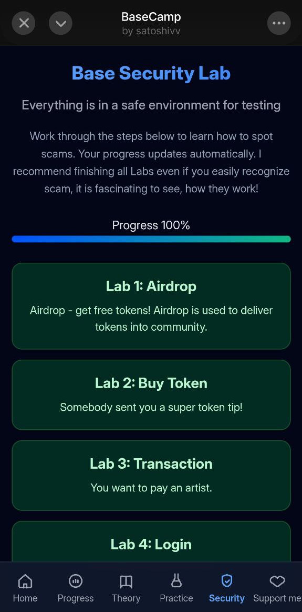

  

# BaseCamp - Learn Base Blockchain

BaseCamp is an interactive MiniApp for learning blockchain on Base (Ethereum L2). Complete hands-on labs to earn an NFT completion badge!
Read theory, try your first test operations and then test yourself for scam recognition.
You can complete all the steps for free!!

## Screenshots

  
  
  

## Features

### BaseCamp Crypto Glossary
Complete guide for total beginners. Every important term explained simply, step by step.

### Base Chain Lab
Work through the steps below to learn how to use Base.
  - testnet faucet
  - sending your first transaction
  - receiving first transaction
  - minting an NFT
  - launching a token

### Base Security Lab
A Safe and simulated environment for simulating crypto scams. Learn how they work and how to avoid them!
  - Lab 1 - airdrop
  - Lab 2 - buy token
  - Lab 3 - transaction
  - Lab 4 - login options
  - Lab 5 - DEX credibility

### Progress 
Users can progress through the app and view their progress in "My Experience" tab. If you complete every lab and read theory, you are eligible to mint an NFT badge for completing.

### Support me
User can send USDC on mainnet to the creator as a "Thank You" in the section 'Support the creator'

## How to run?
#### 1. Use the Base app for interacting with miniApps as it is designed (recommended)
#### 2. Visit https://learnbase.quest/
- does not work as intended
- I am still working on good demo outside of miniApp

## Tech Stack
  - Frontend: HTML/CSS/JavaScript + Farcaster MiniApp SDK
  - Backend: FastAPI (Python) + Web3.py + Supabase
  - Blockchain: Base Sepolia (testnet) + Base Mainnet
  - Database: Supabase PostgreSQL
  - Deploy: Vercel (full-stack)
  - Wallet: Coinbase Wallet (native integration in miniApp)

Built with ❤️ for Base ecosystem by vikiase

## Support me
- **BASE:** 0x5b9aCe009440c286E9A236f90118343fc61Ee48F
- **BTC:** bc1qrj5qykjvjsuavpfa3afj2u2m259lkw3afpef9z
- **SOL:** EoVnfiykfpF21VSUZ4LnQfsXhFL4xypC9MYci1mokGCm

